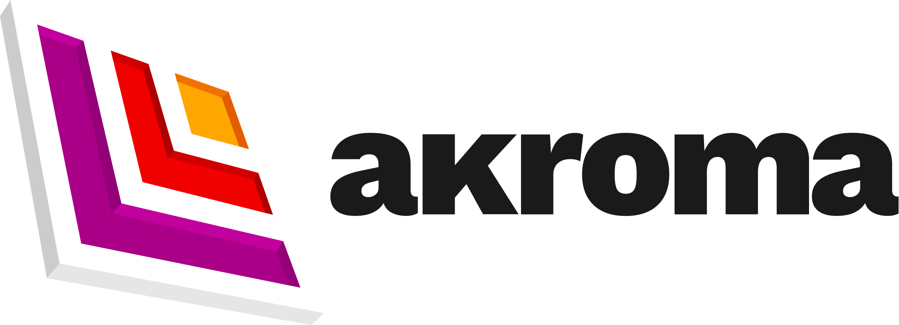

<!-- <!-- // TODO: setup Travis CI  -->
[](https://akroma.io/)
[![Tweet][twitter-badge]][twitter]
[![Tweet][twitter-follow-badge]][twitter-follow]
[![Chat with us on discord][discord-badge]][discord]
[![Star on GitHub][github-star-badge]][github-star]
[![Watch on GitHub][github-watch-badge]][github-watch]
[![Make a pull request][prs-badge]][prs]
<!-- [![Travis Build Status][build-badge]][build] -->
[GNU General Public License v3.0](LICENSE)  

<!-- 
[build]: https://github.com/akroma-project/akroma-wallet-desktop.svg?branch=master
[build-badge]: https://github.com/akroma-project/akroma-wallet-desktop.svg?branch=master
-->


# Introduction

This is the Akroma Desktop wallet.

Currently runs with:

- Angular v5.2.9
- Angular-CLI v1.7.4
- Electron v1.8.4
- Electron Builder v20.8.1

With this sample, you can :

- Run your app in a local development environment with Electron & Hot reload
- Run your app in a production environment
- Package your app into an executable file for Linux, Windows & Mac

## Getting Started


install using [NVM](https://github.com/creationix/nvm) node package manager or download it from [nodejs.org](https://nodejs.org/en/)

Clone this repository locally :

``` bash
git clone https://github.com/akroma-project/akroma-wallet-desktop.git
```

Install dependencies with npm :

``` bash
npm install
```

There is an issue with `yarn` and `node_modules` that are only used in electron on the backend when the application is built by the packager. Please use `npm` as dependencies manager.


If you want to generate Angular components with Angular-cli , you **MUST** install `@angular/cli` in npm global context.  
Please follow [Angular-cli documentation](https://github.com/angular/angular-cli) if you had installed a previous version of `angular-cli`.

``` bash
npm install -g @angular/cli
```

## To build for development

- **in a terminal window** -> npm start  

Voila! You can use your Angular + Electron app in a local development environment with hot reload !

The application code is managed by `main.ts`. In this sample, the app runs with a simple Angular App (http://localhost:4200) and an Electron window.  
The Angular component contains an example of Electron and NodeJS native lib import.  
You can desactivate "Developer Tools" by commenting `win.webContents.openDevTools();` in `main.ts`.

## Manage your environment variables

- Using local variables :  `npm start` or `cross-env ENV=local npm start`
- Using development variables :  `cross-env ENV=dev npm start`
- Using production variables  :  `cross-env ENV=prod npm start`

## Included Commands

|Command|Description|
|--|--|
|`npm run ng:serve`| Execute the app in the browser |
|`npm run build`| Build the app. Your built files are in the /dist folder. |
|`npm run build:prod`| Build the app with Angular aot. Your built files are in the /dist folder. |
|`npm run electron:local`| Builds your application and start electron
|`npm run electron:linux`| Builds your application and creates an app consumable on linux system |
|`npm run electron:windows`| On a Windows OS, builds your application and creates an app consumable in windows 32/64 bit systems |
|`npm run electron:mac`|  On a MAC OS, builds your application and generates a `.app` file of your application that can be run on Mac |

**Your application is optimised. Only /dist folder and node dependencies are included in the executable.**

## Browser mode

Maybe you want to execute the application in the browser (WITHOUT HOT RELOAD ACTUALLY...) ? You can do it with `npm run ng:serve`.  
Note that you can't use Electron or NodeJS native libraries in this case. Please check `providers/electron.service.ts` to watch how conditional import of electron/Native libraries is done.

## Contributors


core team
---

[](https://github.com/iandesj)
[](https://github.com/detroitpro)
[](https://github.com/StephenKoller)

---


community
---
[](https://github.com/seanjnkns)
[](https://github.com/astronautskaspars)


[discord]: https://discord.gg/QRmKYvs
[discord-badge]: https://img.shields.io/discord/102860784329052160.svg

[twitter-follow]: https://twitter.com/intent/follow?screen_name=akroma_io
[twitter-follow-badge]: https://img.shields.io/twitter/follow/espadrine.svg?style=social&label=Follow

[twitter]: https://twitter.com/intent/tweet?text=Check%20out%20Akroma%20Desktop%20wallet!%20https://github.com/akroma-project/akroma-wallet-desktop%20%F0%9F%91%8D
[twitter-badge]: https://img.shields.io/twitter/url/http/shields.io.svg?style=social

[github-star]: https://github.com/akroma-project/akroma-wallet-desktop/stargazers 
[github-star-badge]: https://img.shields.io/github/stars/badges/shields.svg?style=social&label=Stars

[github-watch]: https://github.com/akroma-project/akroma-wallet-desktop/watchers
[github-watch-badge]: https://img.shields.io/github/watchers/badges/shields.svg?style=social&label=Watch

[prs]: http://makeapullrequest.com
[prs-badge]: https://img.shields.io/badge/PRs-welcome-brightgreen.svg?style=flat-square

[license]: https://github.com/akroma-project/akroma-wallet-desktop/blob/master/LICENSE
[license-badge]: https://img.shields.io/badge/license-Apache2-blue.svg?style=flat

